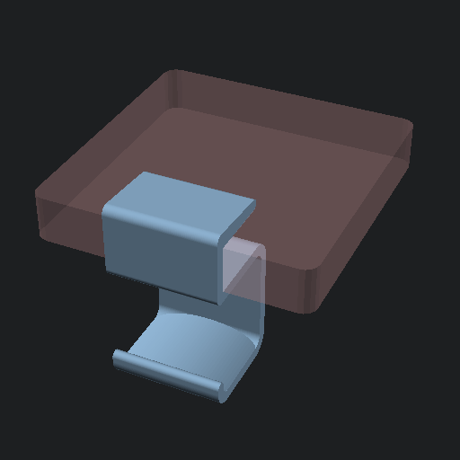

# Headset mount

A simple, yet effective, headset mount for clipping on to the edge of your desk.


## Customization

TODO

## How-to

The OpenSCAD source code is placed in the `scad/` folder. Either open the `*.scad` files interactively
in the OpenSCAD GUI or run the following command to build the `*.stl` and `*.png` files:

```
make
```

Output files will be placed in the `stl/` and `preview/` folder.

## License

<p xmlns:cc="http://creativecommons.org/ns#" xmlns:dct="http://purl.org/dc/terms/"><a property="dct:title" rel="cc:attributionURL" href="https://github.com/anorm/headset-mount">Headset mount</a> © 2025 by <span property="cc:attributionName">anorm</span> is licensed under <a href="https://creativecommons.org/licenses/by-sa/4.0/?ref=chooser-v1" target="_blank" rel="license noopener noreferrer" style="display:inline-block;">CC BY-SA 4.0</a></p>


